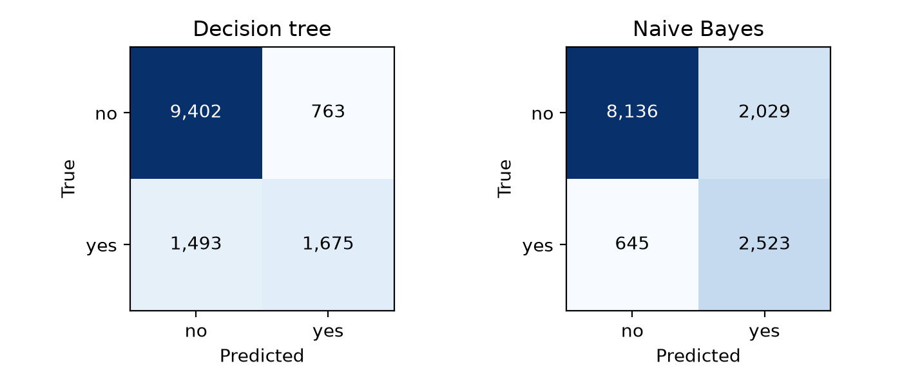

## 1. Data exploration and cleaning

**Data.** `train.csv`: 31,112 rows × 16 columns (7 numeric, 8 categorical/boolean features, target `label`). The provider's `test.csv` (13,334 rows, same columns, labels present) is the held-out test set, untouched until final evaluation (L4 p3). Class split: `no` 23,645 / `yes` 7,464 (minority share 0.240); test minority share 0.238, a class-share difference of 0.002, so no distribution shift.

**Cleaning.** 3 training rows and 1 test row had no label and were dropped (31,109 / 13,333 left). Exact duplicate rows: 0. Missing values are rare (largest share 0.000225, `brew_preference`), so they are imputed without indicator columns: median for numeric (L3 p10), mode for categorical (L3 p11), fitted inside each pipeline on training folds only (L4 p3). The level `Unknown` in `personal_interest` and `species` is **kept as an informative category, not treated as missing**. Outliers outside Tukey's fences are kept and only counted (e.g. `activity_duration` 0.172, `load_ratio` 0.081 of rows): without task knowledge they cannot be called noise (L2 p32), no value is negative, and both models are insensitive to scale. No column is ID-like, and the one-rule leakage screen peaks at 0.591 balanced accuracy (`aptitude_score`), far below 0.95. The column names do not describe a coherent domain, so **semantics are unknown and a semantic leakage check (was each value known before the outcome?) could not be performed**.

**Zeros and caps.** `performance_score` = 0 and `stability_index` = 0 co-occur on 265 training rows, all labelled `no`; `load_ratio` = 0 and `activity_duration` = 0 co-occur on 38 rows. These are kept as real values (see Section 5).

## 2. Feature selection and engineering

All 15 features are kept, and this is a finding: no column is near-constant (largest top-value share 0.897, `region`), no numeric pair has |r| > 0.95, no |skewness| exceeds 2 (max 1.705, `load_ratio`), and there are no date or text columns, so no removal or transform has a measured trigger (L2 p51). Encoding per model (L2 p59): the tree gets ordinal codes and raw numbers. Naive Bayes groups levels below 1% of rows (and unseen test levels) into one rare bucket and bins numeric features into equal-frequency bins (L2 p56). **Judgement call:** `geological_era` has a real chronological order, but with semantics unknown its relevance to the target cannot be verified, and a false order would create arbitrary split boundaries, so all categoricals are treated as nominal (L2 p8). Tree feature importances (embedded selection, L2 p52) concentrate on `weather_pattern` 0.495 and `aptitude_score` 0.266.

## 3. Model training

**Models.** Majority-class baseline (always `no`, L5 p16); **decision tree** (CART, Gini, L4); **categorical Naive Bayes**, chosen because categorical features make up 0.533 ≥ 0.50 of the features. This pairs low-bias, axis-parallel partitions with a high-bias probabilistic model that assumes independence (L5 p36, p48). The variance pilot (depth-5 minus full tree CV: −0.002) did not call for a random forest.

**Validation and search.** 5-fold stratified CV on 31,109 rows (L4 p81), seed 42 for folds and models (an experimental setting, L5 p10). Exhaustive grid search scored by macro-F1: tree `max_depth` {3, 5, 8, None} × `min_samples_leaf` {1, 5, 20} × `ccp_alpha` {0, 0.001} (24 configs); NB `alpha` {0.1, 1} × bins {5, 10} (4 configs). Chosen: tree depth 8, `min_samples_leaf` 20, `ccp_alpha` 0 (173 leaves); NB `alpha` 0.1, 10 bins.

**Stopping criteria.** (1) Model-internal: the tree's pre-pruning stopping criteria are **`max_depth` = 8** (stop splitting at depth 8) and **`min_samples_leaf` = 20** (no split may leave a leaf with fewer than 20 rows) (L4 p44, p58). Post-pruning is controlled by `ccp_alpha` (L4 p59); the selected **`ccp_alpha` = 0** means no post-pruning was applied. NB has no stopping criterion: training is one counting pass, and its grid values (`alpha` = 0.1 smoothing, 10 bins) shape the estimates, not when training stops. (2) Search-level: the grid is exhausted. (3) Overfitting: the gap between training and CV macro-F1 is 0.014 for the tree (0.761 vs 0.747) and 0.000 for NB (0.756 vs 0.755), both far below 0.10 (L4 p50–54).

## 4. Evaluation and comparison

**Metric.** With minority share 0.240 the default rule would be accuracy, but the baseline already scores 0.762 on test without detecting a single `yes`, so tuning on accuracy rewards the majority class (L4 p74). **Macro-F1 is the primary metric** (explicit override); AUPRC is added because PR curves are more informative than ROC under imbalance (L4 p84).

| Model | CV macro-F1 (mean ± sd) | Test accuracy [95% CI] | Test macro-F1 | Test AUPRC |
|---|---|---|---|---|
| Majority baseline | 0.432 ± 0.000 | 0.762 [0.755, 0.770] | 0.433 | 0.238 |
| Decision tree | 0.747 ± 0.006 | 0.831 [0.824, 0.837] | 0.745 | 0.659 |
| Naive Bayes | 0.755 ± 0.004 | 0.799 [0.793, 0.806] | 0.756 | 0.686 |

Accuracy CIs use the Wilson interval (L4 p87–88). ROC-AUC: tree 0.871, NB 0.880. **Paired bootstrap** (1,000 test resamples, seed 42) of macro-F1 tree − NB: observed −0.011, 95% CI [−0.020, −0.002], which excludes 0, so NB is significantly better on the primary metric.

{width=72%}

{width=50%}

## 5. Findings and discussion

**The ranking depends on the metric.** The tree has the higher accuracy (0.831 vs 0.799, non-overlapping CIs) because it favours `no` (recall 0.925 for `no` but 0.529 for `yes`). NB finds far more of the minority class (recall for `yes` 0.796; precision 0.554 vs the tree's 0.687) and wins on macro-F1 and AUPRC. Under the chosen primary metric the difference is significant, so **Naive Bayes is recommended**; it is also the simpler model (4-config grid, no pruning; L4 p56). With 173 leaves at depth 8, the tree is not interpretable in the sense of L4 p45, so it gives up that advantage, and the main reason to prefer it over NB despite its higher accuracy goes with it. The margin is small (−0.011) and the choice should follow the real cost of a missed `yes` versus a false alarm (cost matrix, L4 p75). Both models clearly beat the baseline (macro-F1 0.433).

**Limitations.** (1) **Zero values:** the 265 training rows where `performance_score` and `stability_index` are both 0 are all `no`. The data cannot tell whether this is real signal or a not-recorded code. They are treated as real values; **if they are missing-value codes, the conclusions above could change**, because both models are trained on them as genuine values that coincide only with `no`. (2) Semantics unknown: no domain-based leakage or plausibility check was possible, and treating `Unknown` as informative is an assumption. (3) The bootstrap captures test-sample variance only, not retraining variance; the CV sds (0.006, 0.004) give that view. (4) Only course-taught models with small grids were compared.
