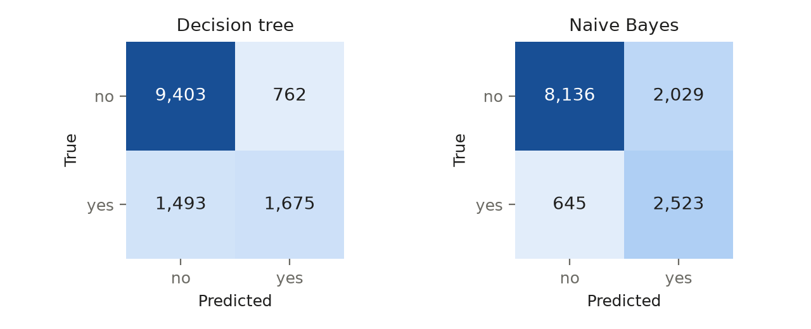

## 1. Data exploration and cleaning

`train.csv` has 31,112 rows × 16 columns: 7 numeric and 8 categorical/boolean features plus the target `label` (no 23,645 / yes 7,464; minority share 0.240). The provided `test.csv` (13,334 rows, same columns) is the held-out test set; its largest class-share difference from training is 0.002, so no shift is reported (L4 p3). Unlabelled rows (3 train, 1 test) were dropped; there are 0 duplicate rows and 0 test rows duplicating a training row, and the test file was not otherwise filtered.

**Missing values.** Each column has 1–7 empty cells, all below 5% → median (numeric, L3 p10) or most-frequent (categorical, L3 p11) imputation, fitted inside each training fold; no indicators. The level `unknown` in `personal_interest` (1,767 rows, 0.057) and `species` (1,760, 0.057) is **deliberately kept as a real level**, not converted by a missing-value default: it may be an informative answer, and converting it would impute over recorded information.

**Suspicious values, kept as recorded.** `performance_score` and `stability_index` are zero on exactly the same 265 rows, and `load_ratio` and `activity_duration` on the same 38 rows (Jaccard 1.0 in both pairs); zero lies outside the Tukey fences of the remaining values in three of the four columns. `aptitude_score` piles up at its maximum 510 (35 rows, a frequency spike) and `performance_score` reaches 1010 on 7 rows. These patterns are consistent with not-recorded codes or caps, but the data cannot distinguish them from genuine values, so imputation would rest on an unverifiable assumption (see §5).

**Outliers** (outside Q1 − 1.5·IQR, Q3 + 1.5·IQR): `activity_duration` 5,350 (0.172), `load_ratio` 2,527 (0.081), `stability_index` 1,128 (0.036), `index_weight` 1,017 (0.033), `aptitude_score` 617 (0.020), `performance_score` 154 (0.005), `composite_rank` 115 (0.004). None is impossible (no negatives) → all kept: without task knowledge they cannot be called noise (L2 p32), and neither model is scale-sensitive (L4 p96).

**IDs and leakage.** No column is ID-like. The best single-feature one-rule screen scores 0.591 balanced accuracy (`aptitude_score`), far below the 0.95 leak flag. The column names do not describe a coherent domain, so **semantics are unknown and the semantic (timing) leakage check could not be performed**.

## 2. Feature selection and engineering

All 15 features are kept, and that is the measured outcome: none is ID-like, none is near-constant (largest single-value share 0.897, `region`, < 0.99), no columns are exact duplicates and no numeric pair has |r| > 0.95 (L2 p51). No feature is skewed beyond |2| (max 1.705) and there are no dates, so nothing is engineered (L1 p54); no PCA (L2 p46). Encoding per model (L2 p59): the tree uses arbitrary integer codes for categories and raw numbers; Naive Bayes groups levels under 1% of rows (and unseen test levels) into one `__rare__` level and puts numeric features into equal-frequency bins (L2 p56). All categoricals are nominal. `geological_era` has an apparent chronological order, but with semantics unknown its relevance to the target cannot be verified, so — as a judgement call — no order is imposed (L2 p8).

## 3. Model training

**Baseline:** always predict `no` (L5 p16). **Model 1: CART decision tree (Gini)** — scale-free, axis-parallel splits (L4 p44, p66). **Model 2: categorical Naive Bayes**, selected because categorical features are 0.533 of all features (≥ 0.50): a high-bias probabilistic model with an independence assumption (L5 p36), contrasting with the tree's low-bias, high-variance partitions (L5 p48). A pilot showed the fully grown tree reaching 1.000 training but 0.695 CV balanced accuracy, no better than a depth-5 tree (0.693) — it memorises noise (L4 p52), so pruning is tuned.

**Validation:** 5-fold stratified CV on the 31,109 training rows (> 1,000 rows, L4 p81); minority share 0.240 ≥ 0.20, so no class weighting. Grid search scored by macro-F1: tree `max_depth` {3, 5, 8, None} × `min_samples_leaf` {1, 5, 20} × `ccp_alpha` {0, 0.001} (24 configurations); NB `alpha` {0.1, 1} × bins {5, 10} (4). Chosen: tree depth 8, `min_samples_leaf` 20, `ccp_alpha` 0; NB `alpha` 0.1, 10 bins. **Stopping criteria:** (1) model-internal — pre-pruning by depth and leaf size (L4 p58), post-pruning by `ccp_alpha` (L4 p59); NB fits in one pass; (2) search — exhaustive grid; (3) overfitting check — training minus CV macro-F1 is 0.014 (tree) and 0.000 (NB), both below 0.10 (L4 p50–54). Seed 42 for CV and models (an experimental setting, L5 p10).

## 4. Evaluation and comparison

**Metric** (chosen by the skill's baseline-relative rule, not by hand): the majority baseline's accuracy is 0.760, above a random guesser's 0.500, so accuracy rewards ignoring `yes` and is rejected (L4 p74). The baseline's macro-F1 is 0.432, below random (0.464), so **macro-F1** (L4 p77) is the primary metric.

| Model | CV macro-F1 (mean ± sd) | Test accuracy [95% CI] | Test macro-F1 | Recall yes | AUPRC yes / ROC-AUC |
|---|---|---|---|---|---|
| Majority baseline | 0.432 ± 0.000 | 0.762 [0.755, 0.770] | 0.433 | 0.000 | 0.238 / 0.500 |
| Decision tree | 0.747 ± 0.006 | 0.831 [0.824, 0.837] | 0.745 | 0.529 | 0.659 / 0.872 |
| Naive Bayes | 0.755 ± 0.004 | 0.799 [0.793, 0.806] | 0.756 | 0.796 | 0.686 / 0.880 |

Test set: 13,333 rows; accuracy CIs use the course interval (L4 p87–88); the AUPRC baseline is the prevalence, 0.238 (L4 p84). **Paired bootstrap** (1,000 resamples of test rows, seed 42) of macro-F1 tree − NB: observed −0.011, 95% CI [−0.020, −0.002]. The CI **excludes 0**, so the difference is significant on this test set (L4 p81, p91).

{width=72%}

{width=55%}

## 5. Findings and discussion

**Recommendation: Naive Bayes.** The bootstrap CI excludes 0, so the primary metric decides and Occam's razor is not used. NB finds 2,523 of 3,168 `yes` rows (recall 0.796) against the tree's 1,675 (0.529), at the cost of more false `yes` predictions (2,029 vs 762; precision 0.554 vs 0.687). The tree's higher accuracy (0.831 vs 0.799, with non-overlapping CIs) comes mostly from the majority class — exactly the behaviour that disqualified accuracy as the primary metric. The margin is small: the upper CI bound is −0.002, and if false `yes` predictions were costlier than misses (L4 p75), the tree could be preferred. Neither model is small: the tree has 173 leaves at depth 8, which is not "small-sized" (L4 p45), and NB estimates 262 conditional probabilities (131 levels × 2 classes) plus 2 priors. The tree's importances concentrate on `weather_pattern` (0.495) and `aptitude_score` (0.266).

**Limitations.** (1) *Possible recording artifacts.* In training, the 265 shared-zero rows are all class `no` (yes 0), the 38-row pair is no 32 / yes 6, the 510 pile-up is no 12 / yes 23 and the 1010 rows are no 7 / yes 0. If these zeros are missing-value codes, or the maxima are caps, the models are partly learning a recording artifact, and the conclusions would change. (2) *Semantics unknown:* there is no timing-based leakage check, the `unknown` level is kept by judgement (no 1,614 / yes 153 in `personal_interest`), and `geological_era` is treated as nominal. (3) The tree's integer codes impose an arbitrary order on nominal levels. (4) The bootstrap captures test-sample variance only, not retraining variance (CV sd 0.006 tree, 0.004 NB); single seed; no sampling.
