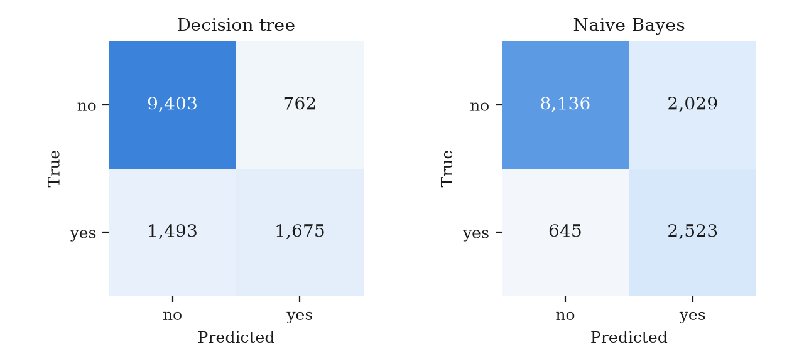

## 1. Data exploration and cleaning

`train.csv` has 31,112 rows and 16 columns (comma-delimited, header row): 7 numeric, 7 categorical and 2 boolean columns, one of which is the target `label` (last column, two classes). After dropping the 3 rows with no `label`, training has 31,109 rows: `no` 23,645, `yes` 7,464 (minority share 0.240). The provided `test.csv` (same 16 columns) is the held-out test set, untouched until final evaluation (L4 p3): 13,333 labelled rows (`no` 10,165, `yes` 3,168); the largest class-share difference between the files is 0.002, so there is no distribution shift.

**Quality issues.** There are 0 exact duplicate rows and 0 test rows that duplicate a training row (L2 p29). Missing values are empty strings only, at most 0.022% of any column (`brew_preference`). Since this is under 5%, they are imputed with the median for numeric columns (L3 p10) and the mode for categorical ones (L3 p11), with no indicator columns. Imputers are fitted on training folds only (L4 p3). Possible disguised missing values were shown to the user, who chose to **keep them as real values**: an `Unknown` level in `personal_interest` (1,767 rows) and `species` (1,760); zeros shared by `performance_score` and `stability_index` (265 rows, Jaccard 1.0, all `no`) and by `load_ratio` and `activity_duration` (38 rows, `no` 32 / `yes` 6); and 35 rows at the maximum of `aptitude_score` (510), possibly a cap.

**Outliers** (Tukey fences): `activity_duration` has 5,350 rows outside the fences (0.172), `load_ratio` 2,527 (0.081), and the other numeric columns at most 0.036. They were kept: without task knowledge they cannot be shown to be noise (L2 p32, p60), and neither model is scale-sensitive. No value is negative, so none is impossible (L2 p8–10).

**IDs and leakage.** No column has a distinct-value ratio above 0.95, so none is ID-like (L2 p6). As a one-rule classifier (balanced accuracy, 3-fold CV), the best single feature is `aptitude_score` at 0.591, far below the 0.95 leak threshold. The column names are real words but form no coherent domain, so **the meaning of the columns is unknown, and the check of whether a value is known before the outcome could not be performed.**

## 2. Feature selection and engineering

All 15 features were kept, a deliberate finding. The highest single-value share is 0.897 (`region`), below the 0.99 near-constant cut (L2 p51); there are no duplicate columns and no numeric pair with |r| > 0.95. No column is skewed past |2| (maximum 1.705, `load_ratio`) and there are no date or text columns, so nothing called for a new feature. PCA would cost interpretability (L2 p46–48), and building features from names of unknown meaning would be guesswork (L1 p54).

**Encoding per model** (L2 p59). Tree: categorical columns as ordinal codes (unseen levels → −1), numeric as is. Naive Bayes: levels with < 1% of rows (17 levels of `region`, 4.8% of rows; 2 each in `geological_era` and `mineral_type`) and unseen levels go to a `__rare__` bucket; numeric columns become equal-frequency bins (L2 p56). No column has an evident order, so all are nominal (L2 p8).

As embedded selection (L2 p52), tree importances are led by `weather_pattern` (0.495) and `aptitude_score` (0.266), while `region` and `geological_era` (0.001 each) contribute almost nothing. `weather_pattern` scored only 0.5 alone in the one-rule screen, so its value appears only in combination with other features.

## 3. Model training

**Baseline:** always predict the majority class `no` (L5 p16). **Model 1:** a CART tree with Gini (L4): scale-free, handles mixed types, insensitive to outliers, but with axis-parallel boundaries (L4 p66). **Model 2:** categorical Naive Bayes, chosen because 8 of the 15 features are categorical or boolean (share 0.533 ≥ 0.50). It is a high-bias model that assumes features are independent given the class (L5 p36), in contrast with the tree's low-bias, high-variance partitions (L5 p48). A random forest was not triggered: a depth-5 tree did not beat a full tree in CV (difference −0.002 < 0.02), and there are fewer than 50,000 rows.

**Validation:** 5-fold stratified CV, seed 42 (a setting, not a hyperparameter, L5 p10); 31,109 rows make 5 folds stable at modest cost (L4 p81). Minority share 0.240 ≥ 0.20, so no class weighting.

**Search:** an exhaustive grid scored by macro-F1. Tree: `max_depth` in {3, 5, 8, None} × `min_samples_leaf` in {1, 5, 20} × `ccp_alpha` in {0, 0.001}, 24 configurations; best `max_depth` 8, `min_samples_leaf` 20, `ccp_alpha` 0. Naive Bayes: `alpha` in {0.1, 1} × bins in {5, 10}, 4 configurations; best `alpha` 0.1, 10 bins.

**Stopping criteria.** (1) Inside the model: tree pre-pruning (`max_depth`, `min_samples_leaf`, L4 p58) and post-pruning (`ccp_alpha`, L4 p59); the chosen `min_samples_leaf` = 20 is the grid's largest value. Naive Bayes is fitted by counting. (2) The search stops when the grid is exhausted. (3) Overfitting check: the training − CV macro-F1 gap is 0.014 (tree) and 0.000 (Naive Bayes), well under 0.10 (L4 p50–54).

The fitted tree has depth 8 and 173 leaves. Naive Bayes estimates 262 conditional probabilities (131 categories × 2 classes).

## 4. Evaluation and comparison

**Metric.** Always predicting `no` scores accuracy 0.760 > random 0.500, so accuracy rewards exploiting the class distribution and is rejected (L4 p74). On macro-F1 that baseline scores 0.432 < random 0.464, so **macro-F1** (F-measure averaged over classes, L4 p77) is the main metric. The results table also gives accuracy with its Wilson 95% CI (L4 p87–88), AUPRC for `yes` (baseline = prevalence 0.238, L4 p84) and ROC-AUC (L4 p83); CV is mean ± sd.

| Model | CV macro-F1 | Test acc. [95% CI] | Test macro-F1 | Rec./prec. yes | AUPRC | ROC-AUC |
|---|---|---|---|---|---|---|
| Baseline | 0.432 ± 0.000 | 0.762 [0.755, 0.770] | 0.433 | 0.000 / 0.000 | 0.238 | 0.500 |
| Decision tree | 0.747 ± 0.006 | 0.831 [0.824, 0.837] | 0.745 | 0.529 / 0.687 | 0.659 | 0.872 |
| Naive Bayes | 0.755 ± 0.004 | 0.799 [0.793, 0.806] | 0.756 | 0.796 / 0.554 | 0.686 | 0.880 |

Both models beat the baseline on every metric; on test macro-F1, tree − NB = −0.011. A paired bootstrap (1,000 resamples of the 13,333 test rows, seed 42, both models scored on the same resample because they share the test rows, L4 p81, p91) gives a 95% CI for the difference of **[−0.020, −0.002]**. The interval excludes 0, so the difference is significant; the tree was better in only 0.008 of the resamples.

{width=100%}

{width=85%}

## 5. Findings and discussion

**Recommendation: Naive Bayes.** The bootstrap CI excludes 0, so the main metric decides, and Occam's razor (L4 p56) is not invoked. The two models make different trade-offs. The tree has the higher accuracy (0.831 vs 0.799, with non-overlapping CIs) because it favours `no`: it finds 0.529 of the `yes` cases at precision 0.687. Naive Bayes finds 0.796 of them at precision 0.554 (2,523 vs 1,675 true positives, but 2,029 vs 762 false alarms). Its AUPRC (0.686 vs 0.659) and ROC-AUC (0.880 vs 0.872) are also higher, so its advantage does not depend only on the default 0.5 decision threshold. If false `yes` predictions cost much more than misses, a cost matrix (L4 p75) could favour the tree.

Neither model overfits much (gaps 0.014 and 0.000), and the CV scores (0.747 ± 0.006 vs 0.755 ± 0.004) agree with the test ranking. With depth 8 and 173 leaves, the tree is not "small" (L4 p45), so its interpretability is limited to its top splits.

**Limitations.** The meaning of the columns is unknown, so leakage was checked only statistically. Zeros and `Unknown` were kept as real values; the 265 training rows (122 test rows) with both `performance_score` and `stability_index` at 0 are all `no`, so if those zeros are "not recorded" codes linked to the outcome, both models profit in a way that may not carry over. The bootstrap captures test-sampling variation, not retraining variation (the CV sd gives that view). The tree's best `min_samples_leaf` is at the grid edge, and the significant difference is small (0.011), so stronger pruning or decision-threshold tuning, neither done here, could change the ranking.
